# 🌍 Web_project_around_auth: EUA Afora

⮕ Este projeto compõe a **Sprint 17** da formação em **Desenvolvimento Web** pela **TripleTen**.

⮕ Objetivo: consolidar o domínio sobre **autenticação e autorização no front-end com React**, aplicando boas práticas de modularidade e experiência do usuário (UX).

⮕ Continuação do projeto anterior: [Web_project_around_react: EUA Afora](https://github.com/VanessaYuriAB/web_project_around_react)

<!-- 📘 Informações gerais -->

[]()

---

## 📘 1. Descrição

**Web_project_around_auth** preserva toda a estrutura funcional do projeto anterior **EUA Afora em React** (cards, curtidas, popups e edição de perfil), adicionando uma camada completa de **autenticação e autorização** no front-end.

Agora é necessário que o usuário esteja autenticado para interagir com a aplicação, permitindo **registro, login e controle de sessão** por meio de **token JWT**, com persistência via `localStorage` e validação com a API de autenticação da TripleTen.

Os usuários podem:

- Criar uma conta (`/signup`)
- Fazer login (`/signin`)
- Acessar conteúdo protegido apenas após autenticação (`/`)
- Encerrar a sessão com segurança (`onSignOut`)

📌 O app conecta-se a um back-end temporário da TripleTen para a validação e autenticação.

<!-- ⚙️ Tecnologias principais -->

[](https://react.dev/)
[](https://vitejs.dev/)
[](https://developer.mozilla.org/docs/Web/JavaScript)
[](https://jwt.io/)
[]()

<!-- 🧰 Ferramentas e qualidade de código -->

[](https://eslint.org/)
[](https://prettier.io/)
[](https://github.com/VanessaYuriAB/web_project_around_auth/actions)
[]()
[]()

<!-- 💾 Infraestrutura e controle de versão -->

[](https://git-scm.com/)
[](https://github.com/VanessaYuriAB/web_project_around_auth)

<!-- 🧪 Testes e segurança -->

[](https://jwt.io/)
[]()

<!-- 🌍 Compatibilidade -->

[]()
[]()

---

## ⚙️ 2. Funcionalidades implementadas

### 🔑 Autenticação e autorização

- **Rotas:**
  - Registro de novos usuários com e-mail e senha (`POST /signup`)
  - Login de usuários existentes (`POST /signin`)
  - Validação automática do token JWT (`GET /users/me`)
- **Token JWT:** armazenamento e recuperação via `localStorage`
- **Redirecionamento automático via `useNavigate()`:**
  - `/signin` → `/` após login bem-sucedido
  - `/signup` → `/signin` após cadastro
  - `/` → `/signin` se o usuário não estiver autenticado
- **Fluxo de logout:** limpeza do token e redirecionamento para `/signin` (`onSignOut`)
- **Verificação e validação automática do token:** ao carregar o app, via `useEffect`, garantindo a persistência da sessão entre recarregamentos

📌 Lógica de autenticação separada no módulo `auth.js`, responsável por requisições de registro, login e validação de token (`/signup`, `/signin`, `/users/me`)

---

### 🛡️ Proteção de rotas

Acesso à aplicação disponível somente após autenticação.

- Implementação do componente `ProtectedRoute`
- Bloqueio de acesso à rota principal (`/`) para usuários não autorizados
- Controle centralizado no componente `App.js`

---

### 🪟 Feedback visual e UX

- Componente **`InfoTooltip`**: exibe popup informativo de sucesso ou falha no registro e login
- **Header dinâmico**: exibição condicional para usuários logados e não logados
- **Formulários reativos e validados** com `useFormValidator`

📌 O comportamento do Header é controlado via `useLocation`, que identifica a rota atual e exibe links diferentes para `/signup`, `/signin` e `/`.

---

### 🔄 Fluxo de autenticação e autorização:

> Register → (POST /signup) → InfoTooltip (Sucesso) → Login → (POST /signin) → localStorage → ProtectedRoute → Main

📌 Garante o ciclo completo de registro, login, validação e manutenção da sessão entre recarregamentos, redirecionando o usuário de forma segura conforme o estado de autenticação.

---

## 🏗️ 3. Estrutura de pastas e arquitetura React

### 📁 Estrutura de pastas

```bash
src/
├── assets/
│
├── components/
│   ├── App.jsx
│   ├── Header/
│   │   └── Header.jsx
│   ├── Main/
│   │   ├── Main.jsx
│   │   └── components/
│   │       ├── Card/
│   │       │   └── Card.jsx
│   │       └── Popup/
│   │           ├── Popup.jsx
│   │           └── components/
│   │               ├── DeleteConfirmation/
│   │               │   └── DeleteConfirmation.jsx
│   │               ├── EditAvatar/
│   │               │   └── EditAvatar.jsx
│   │               ├── EditProfile/
│   │               │   └── EditProfile.jsx
│   │               ├── NewCard/
│   │               │   └── NewCard.jsx
│   │               └── ImagePopup/
│   │                   └── ImagePopup.jsx
│   ├── ProtectedRoute/
│   │   └── ProtectedRoute.jsx
│   ├── Login/
│   │   └── Login.jsx
│   ├── Register/
│   │   └── Register.jsx
│   ├── InfoTooltip/
│   │   └── InfoTooltip.jsx
│   └── Footer/
│       └── Footer.jsx
│
├── contexts/
│   ├── AuthContext.js
│   └── CurrentUserContext.js
│
├── hooks/
│   ├── useFormSubmit.js
│   └── useFormValidator.js
│
├── utils/
│   ├── Api.js
│   ├── auth.js
│   ├── constants.js
│   ├── FormValidator.js
│   └── utils.js
│
├── index.css
└── main.jsx
```

---

### 🧠 Hooks, estados e contexto

| Hook               | Utilização                                                                                |
| ------------------ | ----------------------------------------------------------------------------------------- |
| `useState`         | Controle de `loggedIn`, `emailLogged`, `currentUser` e `checkingAuth`                     |
| `useEffect`        | Verificação do token no carregamento inicial (`getTokenAndEmail`)                         |
| `useContext`       | Acesso global a `AuthContext`                                                             |
| `useRef`           | Reset e validação de formulários; controle de funções estáveis no `useEffect` de montagem |
| `useFormValidator` | Hook customizado para validação em tempo real                                             |
| `useFormSubmit`    | Hook customizado para controle de envio assíncrono                                        |
| `useLocation`      | Identifica a rota atual para renderizar o Header adequado (`/signin`, `/signup`, `/`)     |
| `useNavigate`      | Redirecionamento programático do usuário (ex.: após login ou logout)                      |

📌 A autenticação é centralizada em `App.js`, que repassa callbacks (`handleLogin`, `handleRegistration`, `onSignOut`) e os estados `loggedIn` e `emailLogged` aos componentes filhos, via contexto e props.

📌 Para evitar reexecuções indesejadas no `useEffect` de montagem (com `[]` como dependência), o projeto utiliza `useRef` para armazenar as funções `navigate` e `onSignOut`. Essa abordagem evita warnings do **ESLint** (`react-hooks/exhaustive-deps`) e garante que o efeito seja executado apenas uma vez, sem depender da referência dessas funções.

```jsx
const navigateRef = useRef(navigate);
const onSignOutRef = useRef(onSignOut);
```

Essa prática é segura nesse contexto porque:

- O efeito roda apenas na montagem;
- As funções são estáveis e não devem mudar durante o ciclo de vida do componente;
- Evita re-renderizações ou chamadas desnecessárias.

A lógica está implementada em `App.jsx`, dentro do `useEffect` responsável pela verificação do token e montagem inicial da aplicação.

💡 Essa técnica é útil em efeitos de montagem (`useEffect` com `[]`) quando funções externas são usadas, mas não devem ser adicionadas às dependências para evitar reexecuções indesejadas.

---

### 🌐 API utilizada

Base URL: `https://se-register-api.en.tripleten-services.com/v1`

| Endpoint                | Método                | Descrição                                   |
| ----------------------- | --------------------- | ------------------------------------------- |
| `/signup`               | `POST`                | Registro de novo usuário                    |
| `/signin`               | `POST`                | Login e geração de token                    |
| `/users/me`             | `GET`                 | Validação de token e obtenção de e-mail     |
| `/cards`, `/users` etc. | `GET/POST/PUT/DELETE` | Mantidos da API anterior (projeto em React) |

📌 A autenticação é gerenciada por um módulo dedicado (`auth.js`), enquanto as demais requisições de dados permanecem em `Api.js`, facilitando a manutenção e segurança do código.

📌 O módulo `Api.js` foi **refatorado** para melhorar a legibilidade, reutilização e manutenção do código. Foi implementada a função genérica `_makeRequest`, responsável por padronizar chamadas à API. Essa classe foi originalmente criada no projeto anterior (_EUA Afora - React_) e **mantida neste projeto com melhorias**.

---

### 💾 Armazenamento local (JWT)

- Token armazenado no `localStorage` sob a chave `jwt`

- Verificação automática ao montar o `App`, no `useEffect` inicial

- Remoção segura do token ao sair (`onSignOut`)

- Redirecionamento automático para `/signin`, caso o token seja inválido:
  - Se o token não for fornecido ou fornecido sem o titular:

  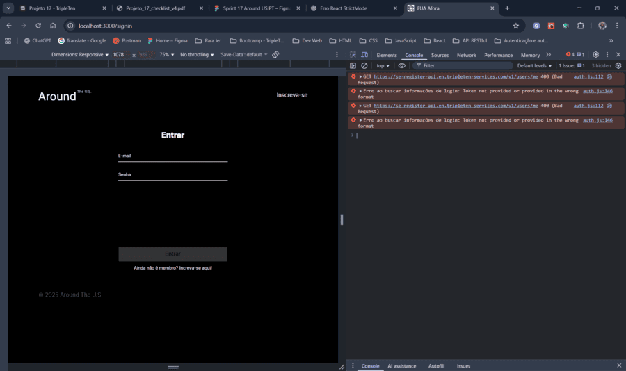
  - Se o token for inválido:

  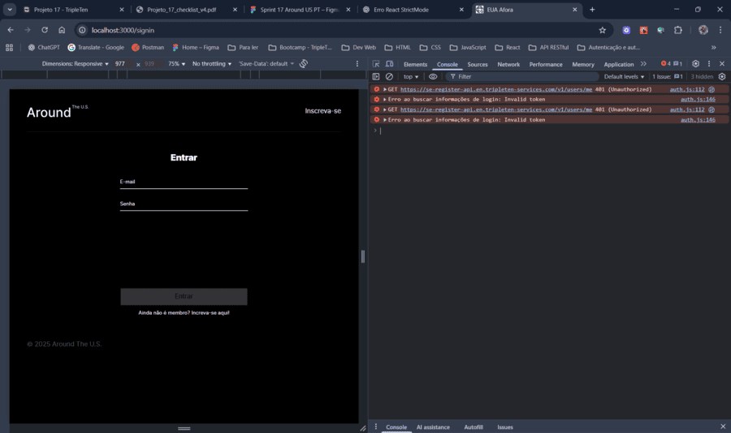

---

### ⚛️ Componentes novos

| Componente              | Função                                                                   |
| ----------------------- | ------------------------------------------------------------------------ |
| **`Register.js`**       | Formulário de cadastro com campos controlados (`email` e `password`)     |
| **`Login.js`**          | Formulário de autenticação com campos controlados (`email` e `password`) |
| **`ProtectedRoute.js`** | Wrapper para rota privada                                                |
| **`InfoTooltip.js`**    | Popup informativo para status de sucesso ou erro no fluxo de auth        |

---

## 🧰 4. Tecnologias e ferramentas

| Categoria                   | Ferramentas                                                                    |
| --------------------------- | ------------------------------------------------------------------------------ |
| **Front-end**               | React, Vite, JSX                                                               |
| **Gerenciamento de estado** | Hooks, Context API                                                             |
| **Autenticação**            | JWT, localStorage                                                              |
| **Roteamento**              | React Router DOM                                                               |
| **Requisições à API**       | Fetch API                                                                      |
| **Validação**               | Hooks customizados (`useFormValidator`, `useFormSubmit`)                       |
| **Estilo e layout**         | CSS modular (BEM Flat)                                                         |
| **Lint e formatação**       | ESLint (Flat Config) + Prettier                                                |
| **Build**                   | Vite (bases automáticas para dev/prod, `outDir: docs`, aliases personalizados) |

📌 Fetch API é utilizada em todas as requisições HTTP nos módulos `auth.js` e `Api.js`, com headers e tratamento de respostas padronizados.

📌 O `vite.config.js` foi configurado para alternar automaticamente a base do projeto conforme o ambiente:

```js
base:
  mode === 'production'
    ? '/web_project_around_auth/' // para GitHub Pages
    : '/', // para ambiente local (npm run dev)
```

_Essa configuração garante que o mesmo build funcione corretamente tanto no ambiente local quanto no deploy do GitHub Pages, sem necessidade de ajustes manuais._ 📦

---

### 🔐 Autenticação com JWT

Implementação de registro, login e persistência de sessão utilizando token JWT.

- `localStorage` para armazenar token de sessão
- Validação automática via endpoint `/users/me`
- Redirecionamento condicional com React Router DOM
- Header dinâmico (usuário logado ↔ visitante)

---

### 🔁 Roteamento com HashRouter (React Router DOM)

Para garantir compatibilidade com o ambiente de deploy — o **GitHub Pages**, que não suporta rotas internas de aplicações SPA com `BrowserRouter`.

📌 Com o `HashRouter`, a aplicação funciona corretamente mesmo ao atualizar a página ou acessar rotas diretamente, utilizando URLs no formato:

```
https://vanessayuriab.github.io/web_project_around_auth/#/signin
```

_Essa abordagem evita erros de redirecionamento e garante que o React controle a navegação sem depender do servidor._

💡 **Por que não usar `BrowserRouter`?**

O `BrowserRouter` exige que o servidor esteja configurado para redirecionar todas as rotas para `index.html`, o que não é possível no **GitHub Pages**. Por isso, o `HashRouter` é a solução ideal para projetos hospedados nesse ambiente.

---

## ✨ 5. Boas práticas implementadas (JavaScript moderno e arquitetura React)

### 🟨 ES6+ (JavaScript moderno)

- Uso de `arrow functions` e `desestruturação`

- Uso de `async/await` para requisições assíncronas

- Tratamento de erros com `try/catch` em funções assíncronas (requisições à API)

### 🟦 Arquitetura e boas práticas em React

- Modularização de lógica em `hooks customizados`

- Renderizações condicionais com `&&` e operadores ternários

- Separação de resposabilidades entre API pública (`auth.js`) e API privada (`Api.js`)

- Validação declarativa com objetos de configuração centralizados (`utils/constants.js`)

- Uso de `Context API` (`AuthContext`) para gerenciamento de autenticação

- Funções `handlers` para lógica de submissão de formulários e controle de estado

- Centralização do tratamento de erros HTTP com função genérica `switchCase` para requisições relacionadas à autenticação (`utils/utils.js`)

- Refatoração da **classe `Api`**, com a implementação da função genérica `_makeRequest` para padronizar chamadas à API, reduzindo duplicação de código e facilitando a manutenção

---

## 💻 6. Visualização em screenshots

| Tela                         | Descrição                                    |
| ---------------------------- | -------------------------------------------- |
| 🧾 **/signup**               | Registro de novo usuário                     |
| 🔐 **/signin**               | Login do usuário                             |
| ✅ **InfoTooltip (Sucesso)** | Feedback visual de cadastro bem-sucedido     |
| ❌ **InfoTooltip (Erro)**    | Feedback visual de erro no cadastro ou login |
| 🏠 **Página principal**      | Exibição autenticada com e-mail no Header    |

Abaixo estão as principais telas que compõem o fluxo completo de autenticação e autorização (JWT):

- Tela de Registro (`/signup`) 🧾

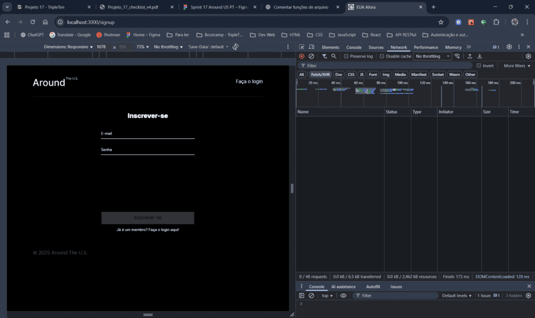

- Tela de Login (`/signin`) 🔐

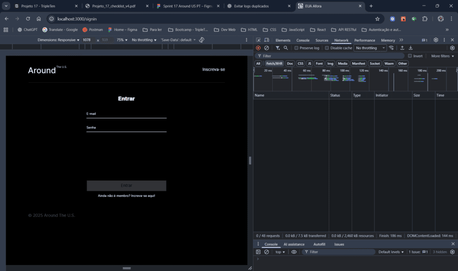

- Tooltip de sucesso no cadastro do usuário ✅

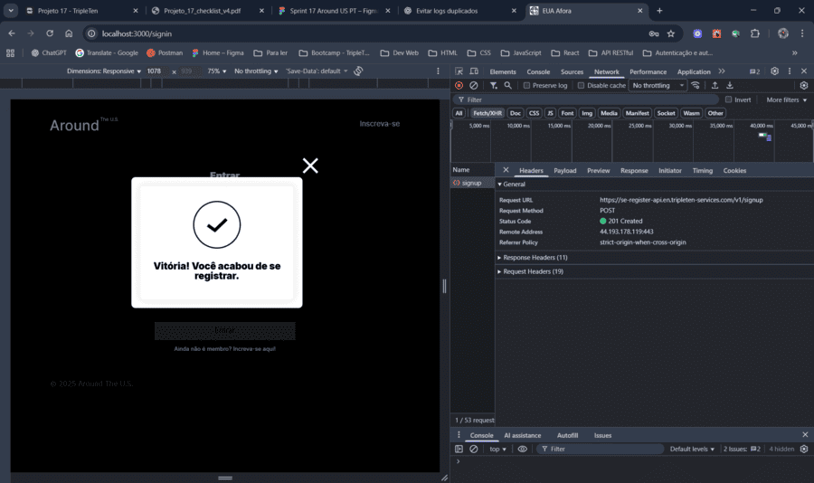

- Tooltip de falha no cadastro do usuário ❌

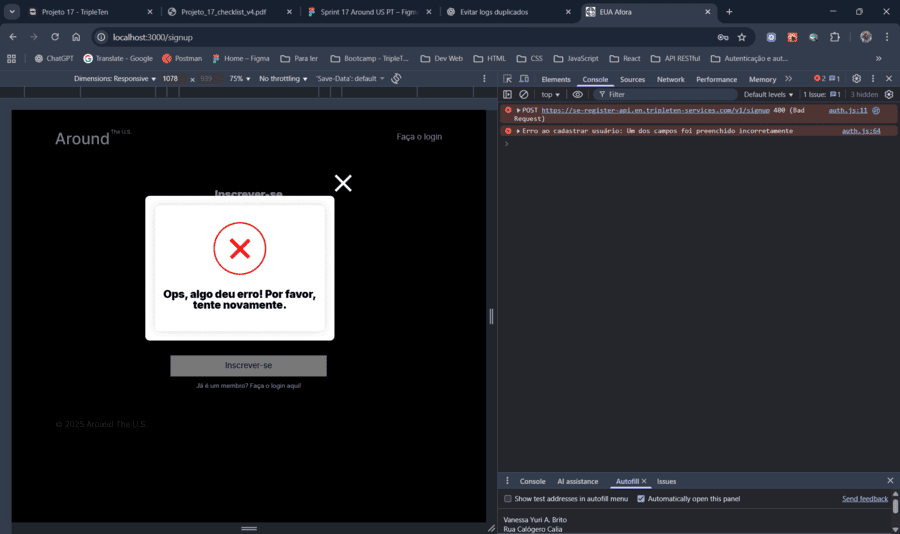

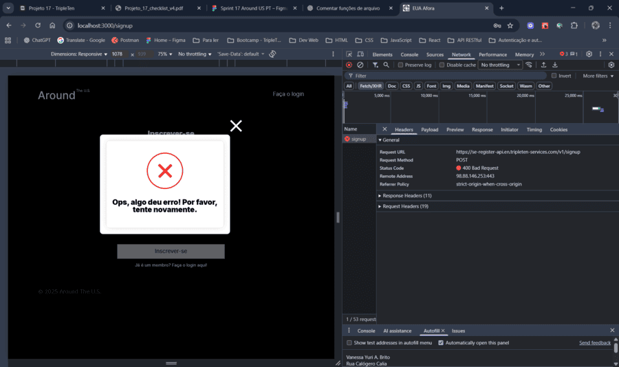

- Tooltip de falha no login ❌


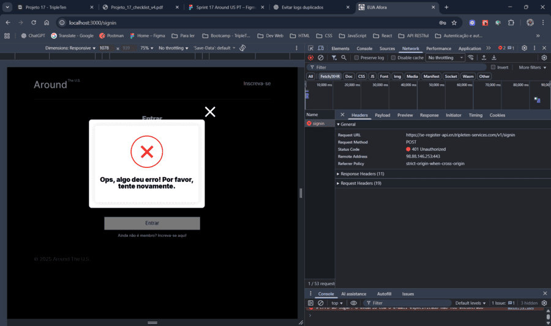

- Página autenticada com e-mail no Header 🏠

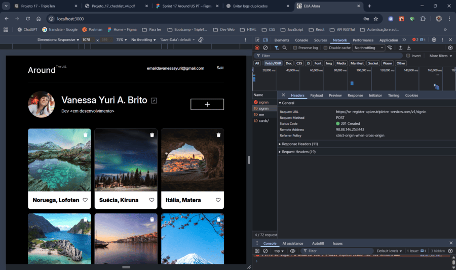

### 📱 Visualização em dispositivos móveis

As telas abaixo mostram a responsividade da aplicação em resoluções mobile, com o layout adaptado para smartphones.

- Tela de Registro (`/signup`) 🧾

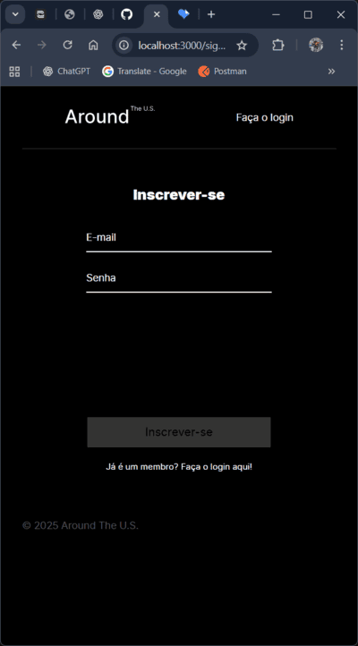

- Tela de Login (`/signin`) 🔐

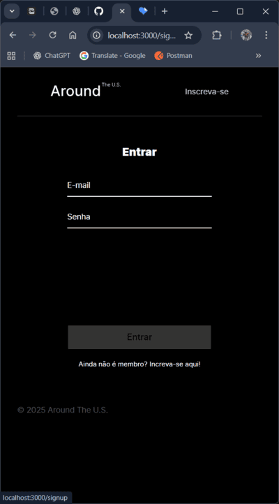

- Tooltip de sucesso ✅

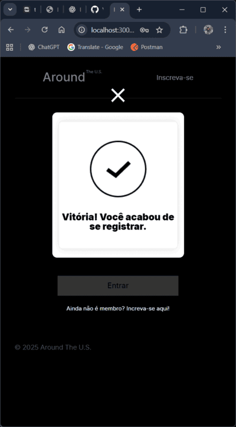

- Tooltip de falha ❌

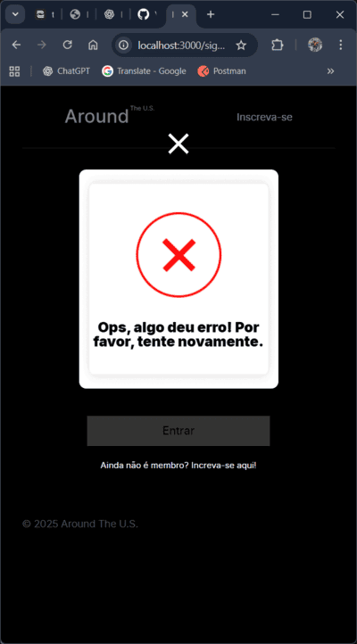

- Página autenticada com e-mail no Header 🏠


---

## 💻 7. Acesse o projeto

📍 GitHub Pages: [https://vanessayuriab.github.io/web_project_around_auth/](https://vanessayuriab.github.io/web_project_around_auth/)

> O deploy via GitHub Pages é apenas demonstrativo — sem persistência real de dados, devido ao back-end temporário. 💡

---

## 🎥 8. Demonstração em vídeo

[Clique aqui para assistir no Loom ⏯️.](https://www.loom.com/share/a07547c857554d34ac811d72ff39d20b?sid=d31bcc46-65dc-4790-841e-14a3a266174e)

---

## 💡 9. Melhorias

### 🔐 Segurança e autenticação avançada:

- Implementar `refresh token` para renovação automática da sessão

- Adicionar **expiração do token** com alerta ao usuário

- Incluir **logout automático** após tempo de inatividade

- Adotar **variáveis de ambiente (`.env`)** para proteger chaves e endpoints

### 💬 Experiência do usuário (UX/UI):

- Implementar **ícone para abrir visualização do email logado e botão para logout** no header em mobile

- Avaliar a aplicação de outras **configurações CSS padrão de tipografia**

- Implementar **spinner de carregamento** com componente `<Loading />` para indicar carregamento da página

- Adicionar **animações suaves** nas transições de rotas e popups (`framer-motion`)

- Implementar **dark mode** com persistência (armazenamento no `localStorage`)

- Mostrar **indicador visual de força de senha** no registro

- Melhorar/especificar **mensagens de erro** (**400**, **401**, **409**, **500**, etc.) exibidas pelo `InfoTooltip`

### 🧱 Arquitetura e manutenção:

- Avaliar a substituição das **imagens de logo e ícones** por **código SVG**

- Avaliar se as **imagens dos tooltips** devem ficar em `assets` ou em `public/images`

- Migrar o controle de autenticação para um **hook dedicado** (`useAuth`)

- Implementar **tratamento global de erros** com `ErrorBoundary`

- Refatorar componentes de formulário em um **FormContainer** reutilizável

### 📱 Acessibilidade e responsividade:

- Verificar a **largura do bloco de informações de perfil** na transição de tablet para mobile - quando a tela se aproxima da largura mínima, os elementos ficam muito justos, sem espaçamento lateral adequado

- Ajustar as **margens verticais dos inputs** nos formulários de adição e de foto, conforme os estados de validação - os elementos se movem quando o `span` de erro aparece ou desaparece

- Adicionar **focus outlines** visíveis para navegação por teclado

### 🌐 Integrações e escalabilidade:

- Adicionar **recuperação de senha** via e-mail (`/forgot-password`)

- Permitir **edição de dados de login** (e-mail e senha) autenticada

- Integrar **OAuth (Google/GitHub)** para **login social**

### 📘 Documentação e apresentação:

- Adicionar **índice clicável** automático com **links de navegação interna**

---

## 📈 10. Próximos passos — Sprint 18

O projeto terá sua última expansão, integrando **back-end próprio**, aplicando **técnicas de segurança** no fluxo JWT, refinando o **tratamento de erros** e consolidando a **versão mobile aprimorada**. 🔮
